# Smoothie

<p align="center">
  
</p>

Multi-model review plugin for Claude Code. Sends your problem or plan to multiple AI models simultaneously, then Claude judges all responses and serves you one blended result.

**Two model tracks:**
- **Codex** — Codex CLI, authenticated via ChatGPT account OAuth
- **OpenRouter** — single API key, models selected at install time from a live ranked list

## Install

```bash
git clone https://github.com/hotairbag/smoothie && cd smoothie && bash install.sh
```

The installer walks you through everything: dependencies, Codex auth, OpenRouter key, and model selection.

Restart Claude Code after install.

## Usage

### Slash command
```
/smoothie <your problem or question>
```

### Auto-blend (plans)
When enabled, every plan is automatically reviewed by all models before you see it. Claude revises the plan with their feedback, then presents the improved version for approval. Zero effort.

Enable during install, or toggle anytime in `config.json`:
```json
{ "auto_blend_plans": true }
```

Adds 30-90s to plan approval while models respond.

### Manage models
```bash
node dist/select-models.js              # re-pick from top models
node dist/select-models.js add openai/gpt-5.4   # add by ID
node dist/select-models.js remove openai/gpt-5.4
node dist/select-models.js list         # show current models
```
No restart needed — config is read fresh on each blend.

## How it works

```
Claude Code
    |
    |-- /smoothie <context>           <- manual slash command
    |-- PreToolUse hook               <- auto-blend on ExitPlanMode
    \-- MCP Server
            \-- smoothie_blend(prompt)
                    |-- Queries all models in parallel
                    |-- Streams live progress to terminal
                    \-- Returns all responses to Claude
```

**Auto-blend flow:**
```
Claude presents plan → ExitPlanMode hook fires → Smoothie blend runs
→ Results injected as context → Claude revises plan → You approve
```

Claude acts as judge. Raw model outputs are never shown. Claude absorbs everything and hands you one result.

## File overview

| File | Purpose |
|---|---|
| `src/index.ts` | MCP server exposing `smoothie_blend` tool |
| `src/blend-cli.ts` | Standalone blend runner (used by hooks) |
| `src/select-models.ts` | Interactive model picker (OpenRouter API) |
| `auto-blend-hook.sh` | PreToolUse hook — auto-blends plans |
| `plan-hook.sh` | Stop hook — plan mode hint (fallback) |
| `install.sh` | One-command installer |
| `config.json` | Model selection + auto_blend_plans flag |
| `.env` | API keys (gitignored) |
